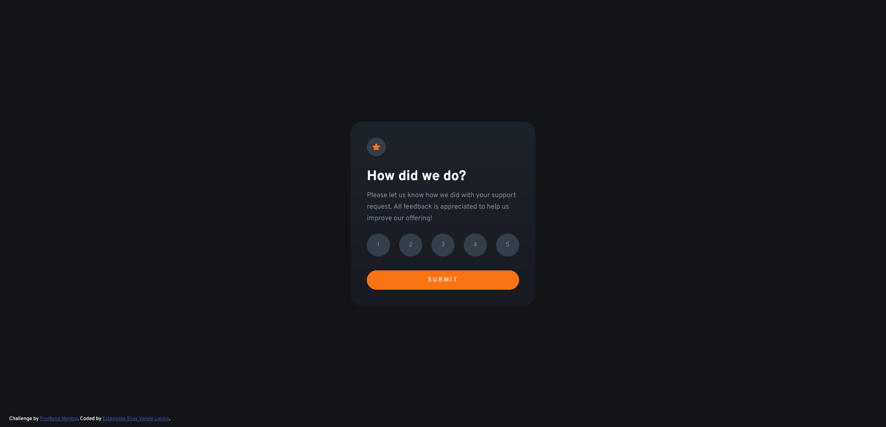
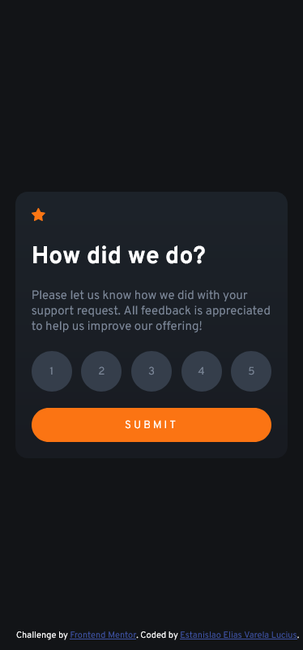

# Frontend Mentor - Interactive rating component solution

This is a solution to the [Interactive rating component challenge on Frontend Mentor](https://www.frontendmentor.io/challenges/interactive-rating-component-koxpeBUmI).

## Table of contents

- [Overview](#overview)
  - [The challenge](#the-challenge)
  - [Screenshot](#screenshot)
  - [Links](#links)
- [My process](#my-process)
  - [Built with](#built-with)
  - [What I learned](#what-i-learned)
  - [Continued development](#continued-development)
  - [Useful resources](#useful-resources)
- [Author](#author)

## Overview

### The challenge

Users should be able to:

- View the optimal layout for the app depending on their device's screen size (DONE)
- See hover states for all interactive elements on the page (DONE)
- Select and submit a number rating
- See the "Thank you" card state after submitting a rating

### Screenshot

- Desktop preview: 

- Mobile preview: 

### Links

- Solution URL: [Add solution URL here](https://your-solution-url.com)
- Live Site URL: [Add live site URL here](https://your-live-site-url.com)

## My process

### Built with

- HTML5
- CSS custom properties
- Flexbox
- Mobile-first workflow
- Vanilla JavaScript
- SASS/SCSS

### What I learned

This project helped me practice programming with Vanilla Javascript, especially DOM manipulation using event handlers added to the different HTML buttons...

### Continued development

I'd like to...
Use this section to outline areas that you want to continue focusing on in future projects. These could be concepts you're still not completely comfortable with or techniques you found useful that you want to refine and perfect.

### Useful resources

- [Example resource 1](https://www.example.com) - This helped me for XYZ reason. I really liked this pattern and will use it going forward.
- [Example resource 2](https://www.example.com) - This is an amazing article which helped me finally understand XYZ. I'd recommend it to anyone still learning this concept.

## Author

- Github - [Estanislao Elias Varela Lucius](https://github.com/EstanisEVL)
- Frontend Mentor - [@EstanisEVL](https://www.frontendmentor.io/profile/EstanisEVL)
